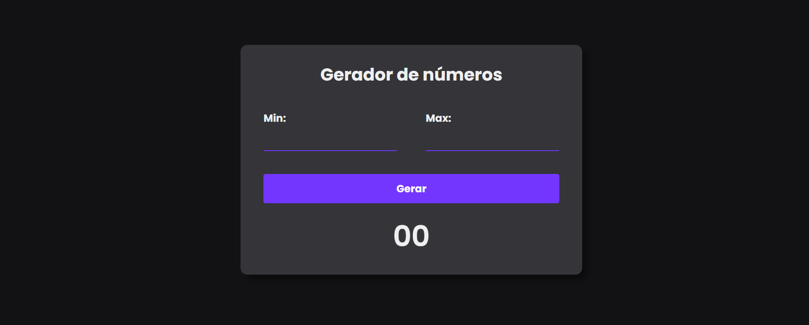

## Gerador de números aleatórios com JavaScript

### 🌐 Fonte
Vídeo [Gerador de números aleatórios entre dois números (Number Generator) | HTML , CSS e JAVASCRIPT](https://youtu.be/w3HSS6cLKeU?si=HpgeVZC0qDAc1GZO) por Larissa Kich.


### 📸 Screenshot


### 🛠️ Tecnologias ultilizadas


### 🧠 O que aprendi 
Aprendi a usar:
- ```.addEventListener```;
- ```Math.floor(Math.random())```;
- ```.querySelector()``` para selecionar um elemento dentro do pai.

### ➕ Melhorias 
- ```:hover``` e ```:focus``` no botão.